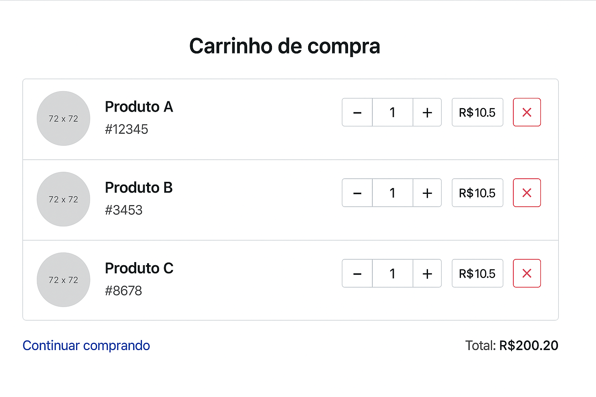

# 🛒 Mini Carrinho de Compras feito com Vue.js + TailwindCSS, focado em aprendizado!

Este é um projeto simples desenvolvido para fixar conceitos fundamentais do **Vue.js** como v-bind, v-model, computed, methods, e manipulação de listas com v-for e também com **HTML** e **TailwindCSS**, sem build, sem complicação.

É perfeito para quem está começando com Vue e quer ver a mágica da reatividade em ação! Só abrir e usar! 😄

## 🔧 Tecnologias Usadas

- Vue.js 3 (via CDN)
- TailwindCSS
- HTML5

## ✨ Funcionalidades

- Aumentar e diminuir quantidade de produtos
- Remover item do carrinho
- Cálculo automático do total

## 🧠 Objetivo

Este projeto foi criado com foco em aprendizado! Ele ajuda a praticar:

- Computed properties
- Manipulação de dados reativos
- Interação com métodos (`add`, `remove`, etc.)
- Estilização com Tailwind

## 🚀 Como Rodar

1. Clone o repositório ou baixe os arquivos
2. Abra o `index.html` em seu navegador
3. Pronto! Seu carrinho está funcionando 😎

## 📁 Estrutura

```
carrinho-vue/
├── assets/
│ └── preview.png
├── index.html
├── app.js
└── README.md
```

## 📷 Preview



---

Feito com 💚 por Humberto Luksevicius
